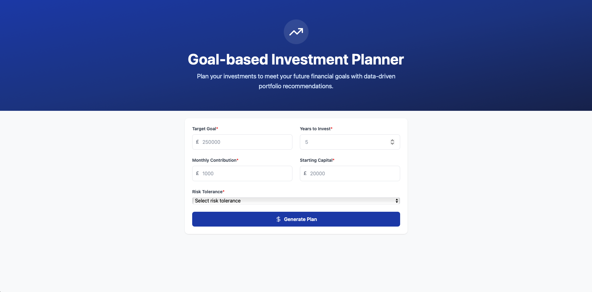
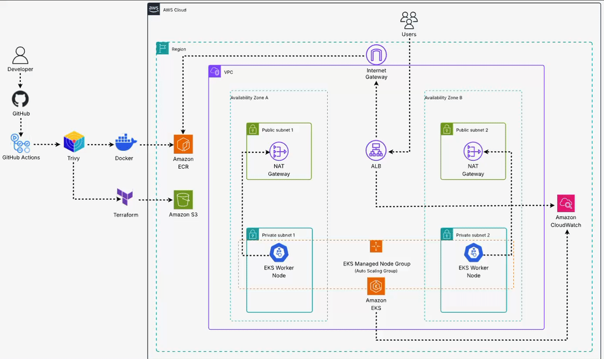
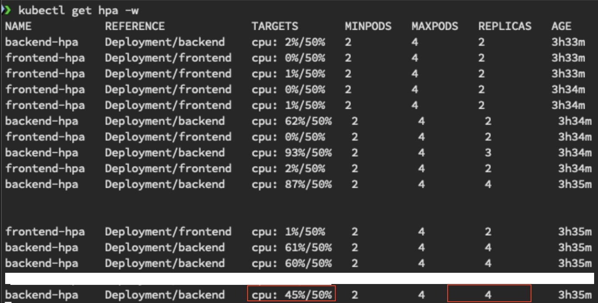

# 🏦 ML Investment Planner – Cloud-Native AWS EKS Deployment

This repository contains the full infrastructure-as-code and application code for **ML Investment Planner**,  
a cloud native web application that utilises machine learning to help users plan long term investment goals using FastAPI, Next.js, and real market data.

  

The project is designed as a **production ready DevOps reference architecture**, demonstrating:
- ✅ AWS EKS + Kubernetes for container orchestration and scaling  
- ✅ Terraform for complete infrastructure provisioning with remote state and locking  
- ✅ GitHub Actions for CI/CD with secure secret management and image scanning  
- ✅ Horizontal Pod Autoscaling (HPA) for automatic up/down scaling  
- ✅ Best practices around least privilege IAM and cost optimisation  

---

## 📌 Key Highlights

- **Full Infrastructure as Code** – Entire VPC, subnets, security groups, EKS cluster, ALB and ECR repositories provisioned by Terraform.
- **Remote State with Locking** – Terraform state stored in Amazon S3 with built-in locking.
- **GitHub Actions CI/CD** – Separate workflows for Terraform, Frontend, and Backend with:
  - Unit testing (pytest, npm test)
  - Trivy vulnerability scanning
  - Secure GitHub Secrets storage
  - Helm based deployment
- **Security by Design** – IAM policies follow **least privilege**.  
  Environment secrets are managed in **GitHub Secrets Manager**.
- **Resilient Scaling** – **Horizontal Pod Autoscaler** scales pods up or down based on CPU utilisation.  
  Designed to handle even choppy traffic patterns.
- **Observability** – EKS control plane logging and CloudWatch metrics for pods and nodes.

---

## 🏗️ System Architecture

  

**Architecture Summary**
- **Networking**: VPC with private and public subnets across two Availability Zones.  
- **Compute**: AWS EKS cluster with managed node groups.  
- **Ingress**: Application Load Balancer providing DNS and routing traffic to frontend and backend services.  
- **Storage**: ECR repositories store container images for the frontend and backend.  
- **Observability**: CloudWatch collects cluster and node metrics.

---

## ⚙️ Infrastructure & CI/CD Workflows

### Terraform Infrastructure
Infrastructure is fully managed with Terraform and split into **two stacks**:
- `terraform/eks` – provisions the VPC, networking, and EKS cluster.
- `terraform/alb` – provisions the ALB and ECR repositories.

Key practices:
- **Remote S3 Backend with Locking**  
  The Terraform state is stored in S3 with server-side locking enabled.  
  This prevents state corruption and enables team collaboration.

- **Double Confirmation Apply/Destroy**  
  GitHub Actions `terraform.yml` workflow requires typing `apply` or `destroy` twice to prevent accidental changes.

### CI/CD Pipelines
Two nearly identical GitHub Actions workflows handle application build and deployment:

**Frontend & Backend Highlights**
- Install dependencies and run unit tests (`npm test` or `pytest`).
- Build production ready Docker images.
- Run a **Trivy vulnerability scan** to block critical issues.
- Push tagged images to ECR (Git commit SHA).
- Deploy to EKS via Helm using the freshly pushed image.

Secrets such as AWS credentials and API URLs are stored securely in **GitHub Secrets Manager** to avoid exposure in code.

---

## 🚀 Getting Started

Follow these steps to recreate the full environment.

### Prerequisites
- **AWS account** with an IAM user having programmatic access (least privilege recommended).
- **Installed locally**:
  - Terraform ≥ 1.6
  - AWS CLI
  - kubectl
  - Helm
  - Docker
  - Node.js and Python 3.10+ (for local testing)

### Fork & Clone the Repo
```bash
git clone https://github.com/Wasim-Ahmed0/ml-investment-planner-infra.git
cd ml-investment-planner-infra
```

### Configure GitHub Secrets

Add these secrets to your GitHub repository:

- **AWS_ACCESS_KEY_ID**
- **AWS_SECRET_ACCESS_KEY**
- **NEXT_PUBLIC_API_URL** – will be updated later with the ALB DNS name, e.g.  
  `http://<alb-dns-name>`

---

### Provision Infrastructure

Dispatch the **Terraform workflow** from GitHub Actions:

1. Go to **Actions → Terraform AWS Infrastructure → Run workflow**.
2. Choose `apply` and confirm again with `apply`.

Terraform will:
- Create the VPC, subnets, and EKS cluster.
- Output the **ALB DNS name** to use as the application URL.

---

### Deploy Applications

After the Terraform workflow succeeds:

1. Update the **NEXT_PUBLIC_API_URL** GitHub secret to include the new ALB DNS name.
2. Push a small code change or manually trigger **frontend** and **backend** workflows to:
   - Build and scan Docker images.
   - Push to Amazon ECR.
   - Deploy to the EKS cluster using Helm.

---

### Verify Deployment

Use these commands to inspect the cluster:

```bash
aws eks update-kubeconfig --region eu-west-2 --name ml-investment-planner-eks --profile <aws-profile>
kubectl get nodes
kubectl get pods -o wide
kubectl get svc
```

---

# 📈 Scaling & Resilience

Horizontal Pod Autoscaler (HPA) ensures the application scales with demand.

## HPA Example

Here’s how scaling is demonstrated:

```bash
# Watch HPA activity
kubectl get hpa -w

# View live CPU metrics
kubectl top pods

# Simulate load on backend
kubectl run loadgen --rm -it --image=busybox -- \
  /bin/sh -c "while true; do wget -q -O- \
  --header='Content-Type: application/json' \
  --post-data='{\"goal\":1000,\"years\":1,\"risk\":\"aggressive\",\"start_capital\":10,\"monthly_contrib\":1}' \
  http://backend.default.svc.cluster.local:8000/api/plan; done"
```

Replace with a screenshot showing pods scaling up.  


Once the artificial load stops, the pods automatically scale back down, saving resources and reducing costs.

## Handling Choppy Traffic

If real production traffic is spiky, an dditional strategy could be integrated in the future to complement HPA:

- **Cluster Autoscaler** – for node level scaling. 

---

## 🔐 Security & Best Practices

- **Least Privilege IAM** – Every Terraform created IAM role and policy follows the principle of least privilege.  
- **GitHub Secrets Manager** – All credentials and sensitive configuration values are securely encrypted and never stored in code.  
- **Immutable Builds** – Docker images are tagged with Git commit SHAs for full traceability and rollback safety.  
- **Infrastructure State Protection** – Terraform state is stored remotely in Amazon S3 with built-in locking to prevent conflicts and enable safe collaboration.  
- **Trivy Image Scans** – Every CI/CD pipeline run includes vulnerability scanning to block critical issues before deployment.  

---

## 🔭 Monitoring & Maintenance

Observability is built in:

- **Amazon CloudWatch** – for EKS control-plane logs and metrics.  
- `kubectl top` and **HPA events** – to monitor real time resource usage and scaling activity.  
- `kubectl describe` – to troubleshoot and inspect pods, services, and events in detail.  

Replace with a screenshot of running pods and HPA activity.  


---

## 🛠️ Future Improvements

- Add **Cluster Autoscaler** for node level scaling in production environments.  
- Add a full **Prometheus + Grafana** stack for advanced monitoring and alerting.  
- Implement automated **disaster recovery** with cross region replication.  

---

## 💡 What I Learned

This project significantly deepened my knowledge in **cloud native DevOps practices** and end-to-end infrastructure delivery.  

Key takeaways include:

- Designing **production grade AWS infrastructure** with Terraform, using remote S3 state and built-in locking for safe team collaboration.  
- Implementing **secure, automated CI/CD pipelines** with GitHub Actions, ECR, and Helm to achieve repeatable and auditable deployments.  
- Strengthening my **Kubernetes operations skills** from writing Helm charts to deploying Horizontal Pod Autoscalers and observing scaling events in real time.  
- Applying **security and cost optimisation best practices**, such as least privilege IAM, immutable builds, and vulnerability scanning, while considering real world scenarios like spiky traffic and scale to zero events.

Overall, this project enhanced my ability to **design, build, and maintain resilient, secure, and scalable cloud applications**, aligning closely with modern DevOps and Site Reliability Engineering (SRE) standards.
